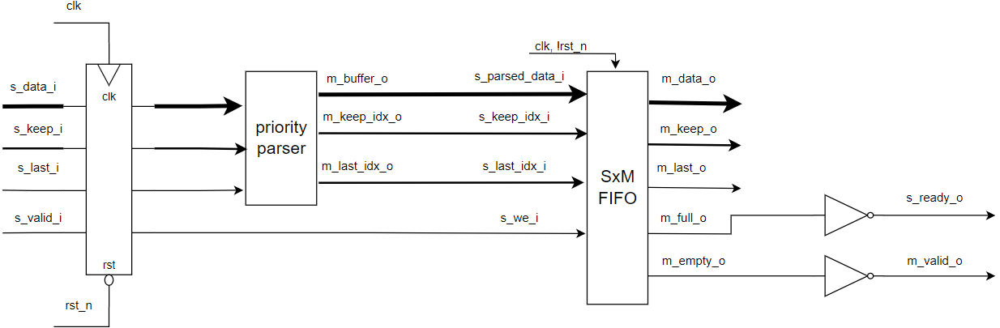

# sntcr_tst_tsk

Реализация потокового ресайзера на языке system verilog.

Далее описаны следующие этапы:

1. [проектирование](#project)

1. [Кодирование и bring-up тест](#coding)

1. [Тестовый синтез](#testing)

## <a name="ptoject"></a> Проектирование

Для структурирования архитектуры устройства, ресайзер разбит на 2 модуля
 - парсер входных пакетов
 - FIFO буффер

Модуль верхнего уровня имеет интерфейс

```verilog
module stream_rescale #(
  parameter T_DATA_WIDTH = `T_DATA_WIDTH_D,
  S_KEEP_WIDTH = `S_KEEP_WIDTH_D,
  M_KEEP_WIDTH = `M_KEEP_WIDTH_D
)(
  input logic                       clk,
  input logic                       rst_n,
  input logic   [T_DATA_WIDTH-1:0]  s_data_i    [S_KEEP_WIDTH-1:0],
  input logic   [S_KEEP_WIDTH-1:0]  s_keep_i,
  input logic                       s_last_i,
  input logic                       s_valid_i,
  output logic                      s_ready_o,
  output logic  [T_DATA_WIDTH-1:0]  m_data_o    [M_KEEP_WIDTH-1:0],
  output logic  [M_KEEP_WIDTH-1:0]  m_keep_o,
  output logic                      m_last_o,
  output logic                      m_valid_o,
  input logic                       m_ready_i
); 
```

Структура модуля выглядит следующим образом



Код модуля доступен по [ссылке](stream_rescale/TOP.sv#L27).

Для генерации пакета, несущего полезную информацию, из входного пакета был спроектирован модуль `priority_parser`. Данный модуль выдает на выход пакет слов размером `S_KEEP_WIDTH*T_DATA_WIDTH`, то есть аналогично входному пакету, в данном пакете слова располагаются в соответствии с полезными словами во входном пакете. В ячейках, индекс которых больше количества полезных слов, располагаются слова входного пакета с индексом 0. Последняя логическая конструкция сделана с целью упрощения логики, так как счетчик буффера записи в FIFO буффере инкрементируется на количество полезных слов в пакете, и слова, расположенные дальше полезных слов будут перезаписаны при следующей записи. Также на выход поступает индекс последнего полезного слова в выходном пакете и индекс последнего слова в транзакции, если входной пакет является последним в транзакции. Архитектура модуля выглядит следующим образом


Код модуля доступен по [ссылке](stream_rescale/TOP.sv#L115).

Так как соотношение `S_KEEP_WIDTH` и `M_KEEP_WIDTH` может быть любым, то возможны случаи, когда данные на входе и выходе  относятся к разным пакетам и транзакциям, поэтому входные данные нужно хранить в промежуточном буффере до востребованности. В связи с этим был реализован модуль буффера с принципом First in - first out. Данный FIFO буффер принимает пакеты размерности `S_KEEP_WIDTH` и хранит их, пока в буффере не накопится количество слов равное `M_KEEP_WIDTH` либо не придет последний пакет в транзакции. Буффер имеет несколько условий записи и чтения. Первое условие записи возникает, если в буффере достаточно места, чтобы записать текущий пакет данных и следующие `S_KEEP_WIDTH` слов, которые могут поступить на вход ресайзера.
На картинке обозначены
| <!-- --> | <!-- --> |
| --- | --- |
| wr_ptr | указатель на следующую ячейку в буффере для записи слова |
| rd_ptr | указатель на следующую ячейку в буффере для чтения слова |
| MAX_PTR | самая старшая ячейка доступная для записи |
| keep_idx_i | количество полезных слов в пакете для записи в буффер |


Данное условие реализуется в соответствии с следующей логикой


Код условия доступен по [ссылке](stream_rescale/TOP.sv#L212).

Следующее условие записи возникает, если текущий входной пакет можно записать в буффер без переполнения, а следующий пакет уже не поместиться в старшие ячейки буффера, при этом указатель для чтения находится дальше от начала буффера, чем размер входного пакета.


Данное условие реализуется в соответствии с следующей логикой


Код для условия доступен по [ссылке](stream_rescale/TOP.sv#L226).

Следующее условие возникает, если в буффер влезает только текущий входной пакет.


Данное условие реализуется в соответствии с следующей логикой


Код для условия доступен по [ссылке](stream_rescale/TOP.sv#L239).

Следующее условие возникает, если указатель для чтения догнал указатель для записи. Это же условие возникает при сбросе модуля.


Данное условие реализуется в соответствии с следующей логикой


Код для условия доступен по [ссылке](stream_rescale/TOP.sv#L252).

Следующее условие возникает, если максимальный размер пакета равен одному слову.


Данное условие реализуется в соответствии с следующей логикой


Код для условия доступен по [ссылке](stream_rescale/TOP.sv#L271).

Схема обновления указателя на следующую ячейку для записи выглядит следующим образом.


Здесь и во всех последующих регистров для записи и чтения названия условий соответствуют выходным сигналам условий. Если выполнено условие нормальной записи, то указатель инкрементируеся на число полезных слов во входном пакете, если следующий пакет не влезает в старшие ячейки буффера, то указатель обнуляется, если буффер полный,  то счетчик инкрементируется на число полезных слов во входном пакете, так как буффер будет полным после текущей записи. Если буффер пустой, то счетчик инкрементируется с условием возможности записи в старшие ячейки буффера. Если размер выходного пакета равен одному слову, то счетчик инкрементируется с условием равенства счетчика в данный момент нулю.

Схема обновления флага заполнености буффера выглядит следующим образом


Флаг устанавливается в 1, если в буффере осталось менее чем `S_KEEP_WIDTH` свободных ячеек.

Схема обновления указателя на следующую ячейку после старшей записанной ячейки в буффере


Данный указатель обновляется, если в старшие ячейки буффера на помещается пакет размером `S_KEEP_WIDTH*T_DATA_WIDTH`. При сбросе данный указатель устанавливается на следущую ячейку в буффере после самой старшей.

Схема обновления флага переноса записи в начало буффера


Данный флаг устанавливается, если указатель записи перемещается в начало буффера, а указатель чтения не дошел до конца буффера. Если данный флаг установлен, то указатель для записи не может инкрементироваться, если он равен указателю для чтения. Это сделано для того, чтобы не перезаписывались входные данные, если указатель для записи догнал указатель для чтения.

FIFO буфферы обновляются в соответствии со следующей логикой


В модуле реализован сдвоенный буффер в котором хранятся данные и флаги, указывеющие на последнее слово в транзакции. В данных буфферах обновляются одновременно `S_KEEP_WIDTH` ячеек, начиная от ячейки, соотвествующей указателю для записи.

Чтение из буффера происходит, если установлен сигнал `m_ready_i` и буффер не пустой (то есть указатель записи находится впереди на  `M_KEEP_WIDTH` слов или дальше, относительно указателя чтения), в этом случае на выход `m_data_o` выводится пакет слов, записанных раньше всего и указатель чтения инкрементируется на `M_KEEP_WIDTH`.

Первое условие чтения возникает, если между указателем чтения и указателем записи, либо указателем чтения и указателем на следующую ячейку после старшей записанной ячейки в буффере (`carry_wr_ptr`) в случае, если произшел перенос указателя записи, есть `M_KEEP_WIDTH` слов или более.


Данное условие реализуется в соответствии с следующей логикой


Код для условия доступен по [ссылке](stream_rescale/TOP.sv#L312).

Следующее условие возникает, если между указателем чтения и самой старшей записаной ячейкой буффера осталось меньше слов, чем размер выходного пакета, а указатель на запись находится дальше от начала, чем количество слов для выходного пакета, которых не хватило для полного заполнения выходного пакета при чтении из старших записанных ячеек.


Данное условие реализуется в соответствии с следующей логикой


Код для условия доступен по [ссылке](stream_rescale/TOP.sv#L325).

Следующее условие возникает, если не выполнены 2 предыдущих, а в одной из ячеек буффера записан последний пакет в транзакции.


Данное условие реализуется в соответствии с следующей логикой


Сигнал `last` рассчитывается комбинационно и описан далее в документе. Код для условия доступен по [ссылке](stream_rescale/TOP.sv#L339).

Сигнал индикации пустого буффера генерируется в соответствии с логикой


Счетчик чтения обновляется в соответствии с логикой


Шина `last_rd_idx` на рисунке выше имеет размер `M_KEEP_WIDTH*M_KEEP_WIDTH` на ней генерируются сигналы соответствующие количеству непоследних слов в транзакции до последнего слова транзакции для текущего выходного пакета в буффере, который соотвествует ячейкам после указателя чтения, если определено последнее слово в транзакции, то сигналы на шине соотвествующего индекса, которые страрше последнего слова в транзакии становятся равными индексу последнего слова в транзакции.


Логика для генерации сигналов на шине


Код генерации сигналов на шине доступен по [ссылке](stream_rescale/TOP.sv#L383).

Шина `last_flag_rd` на рисунке выше имеет размер `M_KEEP_WIDTH` на ней генерируются сигналы соответствующие условию, что текущее или одно из предыдущих слов в текущем выходном пакете является последним словом в транзацкции. Логика для генерации сигналов на шине


Код генерации сигналов на шине доступен по [ссылке](stream_rescale/TOP.sv#L372).

I-й из `M_KEEP_WIDTH` бит валидности в выходном пакете обновляется в соотвествии с логикой


I-е из `M_KEEP_WIDTH` слов размером `T_DATA_WIDTH` в выходном пакете обновляются в соответствии с логикой


Выходной сигнал индикации последнего слова в транзакции обновляется в соответствии с логикой


Сигнал `last` соответствует биту c номером `M_KEEP_WIDTH` на шине `last_flag_rd`.

Также для изменения частоты сигналов к модулю верхнего модуля был подключен PLL IP блок.

## <a name="coding"></a> Кодирование и bring-up тест

Исходный код всех модулей лежит в файле [TOP.sv](stream_rescale/TOP.sv). Код соотвествует описанной выше архитектуре. Testbench для тестирования всех модулей расположен по [ссылке](stream_rescale/stream_rescale_tb.sv). Тестирование проводилось для 

```verilog
`define T_DATA_WIDTH_D 4
`define S_KEEP_WIDTH_D 4
`define M_KEEP_WIDTH_D 7
```

| <!-- --> |
| --- |
| [тестовый вектор для ресайзера](stream_rescale/stream_rescale_testvector.tv) |
| [тестовый вектор для парсера](stream_rescale/priority_parser_testvector.tv) |
| [тестовый вектор для FIFO буффера](stream_rescale/FIFO_testvector.tv) |

Также для отображения временных диаграмм для удобства работы с ModelSim добавлен файл [stream_rescale_run_simulation.do](stream_rescale/stream_rescale_run_simulation.do). К нему надо указать ссылку в среде QUARTUS по следующему пути
`Assignments->Settings->EDA Tool Settings -> Simulation->NativeLink settings->Use script to set up simulation`.

## <a name="testing"></a> Тестовый синтез

Синтез выполнялся для ПЛИС 5CEBA4F17C6 семейства Cyclone V. Был сгенерирован [файл с временными ограничениями](stream_rescale/stream_rescale.sdc) для проведения STA. Синтез в среде QUARTUS производится при запуске файла [stream_rescale.qpf](stream_rescale.qpf) в открывшейся среде Quartus Prime Lite в меню Processing нужно нажать кнопку start compilation. Отчет о синтезе расположен в [stream_rescale/stream_rescale-Analysis_Synthesis.rpt](stream_rescale/stream_rescale-Analysis_Synthesis.rpt). Остальные отчеты расположены в папке[stream_rescale/output_files](stream_rescale/output_files).

Удалось достичь максимальной тактовой частоты в 40 МГЦ при условии, что выходной пакет появляется на выходе, на том же такте, как только в буффере достаточное количество слов для чтения. В случае если пакеты на вход будут поступать постоянно, эффективнее реализовать преобразование в несколько стадий для уменьшения длины путей комбинационной логики. Из-за этого вырастет задержка между входом и выходом, но увеличится максимально возможная частота работы ресайзера. Так, если сделать запись в буффер по фронту синхросигнала, а не по спаду, как это реализовано, то задержка между входом и выходом вырастет до 2 тактов, но  максимально возможная рабочая частота вырастет в 2 раза. 